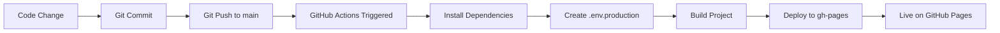

# TradeFlow Frontend Deployment Guide

Complete guide for deploying the TradeFlow React frontend to GitHub Pages using Vite and GitHub Actions.

---

## 📋 Prerequisites

### Required Tools
- **Node.js** (v20.x): [Download](https://nodejs.org/)
- **npm** (v10.x+)
- **Git** (v2.x+)
- **GitHub Account** with repository access

### Required Information
Before deployment, you need:
1. **Backend API URL** (from Backend deployment)
2. **Cognito User Pool ID** (from Backend deployment)
3. **Cognito Client ID** (from Backend deployment)
4. **Razorpay Key ID** (public key from Razorpay Dashboard)

---

## 🛠️ Local Development Setup

### Step 1: Install Dependencies
```bash
cd Frontend
npm install
```

### Step 2: Create `.env.development` File

Create a file named `.env.development` in the `Frontend` directory:

```env
# API Configuration - DEV stage
VITE_API_URL=https://your-api-id.execute-api.us-east-1.amazonaws.com/tradeflow-dev

# AWS Cognito Configuration - DEV
VITE_AWS_REGION=us-east-1
VITE_COGNITO_USER_POOL_ID=us-east-1_xxxxxxxxx
VITE_COGNITO_CLIENT_ID=xxxxxxxxxxxxxxxxxxxxxxxxxx

# Razorpay Configuration - DEV (Test Mode)
VITE_RAZORPAY_KEY_ID=rzp_test_xxxxxxxxxxxxx
```

**How to get these values:**

#### Get Backend API URL
```bash
aws cloudformation describe-stacks \
  --stack-name tradeflow-dev \
  --query "Stacks[0].Outputs[?OutputKey=='ApiBaseUrl'].OutputValue" \
  --output text
```

#### Get Cognito User Pool ID
```bash
aws cloudformation describe-stacks \
  --stack-name tradeflow-dev \
  --query "Stacks[0].Outputs[?OutputKey=='UserPoolId'].OutputValue" \
  --output text
```

#### Get Cognito Client ID
```bash
aws cloudformation describe-stacks \
  --stack-name tradeflow-dev \
  --query "Stacks[0].Outputs[?OutputKey=='UserPoolClientId'].OutputValue" \
  --output text
```

#### Get Razorpay Test Key
1. Go to [Razorpay Dashboard → Settings → API Keys](https://dashboard.razorpay.com/app/keys)
2. Copy **Test Key ID** (starts with `rzp_test_`)

### Step 3: Update Subscription Plan IDs

After creating subscription plans in the backend, update the plan IDs in:

**File**: `src/components/views/ProfileView.tsx`

```typescript
const PLAN_IDS = {
  monthly_99: 'plan_xxxxxxxxxxxxxxxx',   // ← Replace with actual plan ID
  monthly_299: 'plan_xxxxxxxxxxxxxxxx',  // ← Replace with actual plan ID
  monthly_499: 'plan_xxxxxxxxxxxxxxxx',  // ← Replace with actual plan ID
  annual_999: 'plan_xxxxxxxxxxxxxxxx',   // ← Replace with actual plan ID
  annual_2999: 'plan_xxxxxxxxxxxxxxxx',  // ← Replace with actual plan ID
  annual_4999: 'plan_xxxxxxxxxxxxxxxx',  // ← Replace with actual plan ID
};
```

### Step 4: Run Local Development Server
```bash
npm run dev
```

Open browser: `http://localhost:8080`

### Step 5: Test Locally
- ✅ Sign up with new account
- ✅ Verify email (check Cognito console for verification code)
- ✅ Log in
- ✅ Create a trade
- ✅ Test subscription flow with Razorpay test cards

**Razorpay Test Cards:**
- **Success**: `4111 1111 1111 1111`
- **Failure**: `4111 1111 1111 1112`
- CVV: Any 3 digits
- Expiry: Any future date

---

## 🚀 Production Deployment to GitHub Pages

### Step 1: Enable GitHub Pages

1. Go to **Repository → Settings → Pages**
2. Source: **Deploy from a branch**
3. Branch: **gh-pages** / **/ (root)**
4. Click **Save**

### Step 2: Add GitHub Secrets

Go to: **Repository → Settings → Secrets and variables → Actions**

Click **New repository secret** and add the following:

#### Production Backend Configuration
```
VITE_API_URL_PROD
Value: https://your-api-id.execute-api.us-east-1.amazonaws.com/tradeflow-prod
```

#### Production Cognito Configuration
```
VITE_AWS_REGION
Value: us-east-1

VITE_COGNITO_USER_POOL_ID_PROD
Value: us-east-1_xxxxxxxxx

VITE_COGNITO_CLIENT_ID_PROD
Value: xxxxxxxxxxxxxxxxxxxxxxxxxx
```

#### Production Razorpay Configuration
```
VITE_RAZORPAY_KEY_ID_PROD
Value: rzp_live_xxxxxxxxxxxxx
```

**How to get PROD values:**

```bash
# Get PROD API URL
aws cloudformation describe-stacks \
  --stack-name tradeflow-prod \
  --query "Stacks[0].Outputs[?OutputKey=='ApiBaseUrl'].OutputValue" \
  --output text

# Get PROD Cognito User Pool ID
aws cloudformation describe-stacks \
  --stack-name tradeflow-prod \
  --query "Stacks[0].Outputs[?OutputKey=='UserPoolId'].OutputValue" \
  --output text

# Get PROD Cognito Client ID
aws cloudformation describe-stacks \
  --stack-name tradeflow-prod \
  --query "Stacks[0].Outputs[?OutputKey=='UserPoolClientId'].OutputValue" \
  --output text
```

Get **Razorpay Live Key**:
1. Go to [Razorpay Dashboard → Settings → API Keys](https://dashboard.razorpay.com/app/keys)
2. Switch to **Live Mode** (toggle at top right)
3. Copy **Live Key ID** (starts with `rzp_live_`)

### Step 3: Update Production Plan IDs

Update `src/components/views/ProfileView.tsx` with **production** plan IDs (created in prod backend).

### Step 4: Commit and Push

```bash
cd Frontend
git add .
git commit -m "Deploy frontend to GitHub Pages"
git push origin main
```

### Step 5: Monitor Deployment

1. Go to **Repository → Actions**
2. Click on the latest workflow run: **"Deploy to GitHub Pages"**
3. Watch the deployment progress:
   - ✅ Checkout code
   - ✅ Install dependencies
   - ✅ Create .env.production file
   - ✅ Build project
   - ✅ Deploy to GitHub Pages

Deployment takes ~2-3 minutes.

### Step 6: Access Deployed Site

After successful deployment, your site will be available at:

```
https://your-username.github.io/trade-haven/
```

Or if using a custom domain:
```
https://tradeflow.yourdomain.com
```

---

## 🌐 Custom Domain Setup (Optional)

### Step 1: Add CNAME Record in DNS Provider

Add a CNAME record pointing to:
```
your-username.github.io
```

### Step 2: Update GitHub Actions Workflow

Uncomment and update the `cname` line in `.github/workflows/deploy.yml`:

```yaml
- name: Deploy to GitHub Pages
  uses: peaceiris/actions-gh-pages@v4
  with:
    github_token: ${{ secrets.GITHUB_TOKEN }}
    publish_dir: ./dist
    cname: tradeflow.yourdomain.com  # ← Uncomment and update this
```

### Step 3: Update Vite Config

Add base URL in `vite.config.ts`:

```typescript
export default defineConfig(({ mode }) => ({
  base: mode === 'production' ? '/' : '/',  // Use '/' for custom domain
  // ... rest of config
}));
```

### Step 4: Redeploy

```bash
git add .
git commit -m "Add custom domain"
git push origin main
```

### Step 5: Configure in GitHub

Go to **Repository → Settings → Pages**
- Custom domain: `tradeflow.yourdomain.com`
- ✅ Enforce HTTPS

Wait ~10 minutes for DNS propagation and SSL certificate provisioning.

---

## 🔄 Manual Deployment (Alternative)

If you prefer to deploy manually without GitHub Actions:

### Build for Production
```bash
npm run build
```

### Deploy to GitHub Pages Manually
```bash
# Install gh-pages package
npm install -D gh-pages

# Add to package.json scripts
"scripts": {
  "deploy": "gh-pages -d dist"
}

# Deploy
npm run deploy
```

---

## 🔍 Verification & Testing

### 1. Test Production Build Locally
```bash
npm run build
npm run preview
```

Access at: `http://localhost:4173`

### 2. Check Build Output
```bash
ls -lh dist/
```

Verify:
- ✅ `index.html` exists
- ✅ `assets/` directory with JS/CSS bundles
- ✅ File sizes are optimized (< 500KB per chunk)

### 3. Test API Connectivity
Open browser console and check:
```javascript
// Should show production API URL
console.log(import.meta.env.VITE_API_URL)
```

### 4. Test Authentication Flow
1. Sign up new user
2. Check email for verification code
3. Verify account
4. Log in
5. Create a trade
6. View analytics

### 5. Test Subscription Flow
1. Go to Profile → Subscription
2. Click Subscribe on any plan
3. Enter Razorpay test card details (in test mode)
4. Verify subscription status updates
5. Test pause/resume/cancel

---

## 🔧 Troubleshooting

### Issue: GitHub Actions Workflow Fails

**Check Secrets Configuration:**
```bash
# Verify all required secrets are added
Repository → Settings → Secrets and variables → Actions
```

Required secrets:
- `VITE_API_URL_PROD`
- `VITE_RAZORPAY_KEY_ID_PROD`
- `VITE_AWS_REGION`
- `VITE_COGNITO_USER_POOL_ID_PROD`
- `VITE_COGNITO_CLIENT_ID_PROD`

### Issue: 404 on GitHub Pages

**Solution 1**: Check base URL in `vite.config.ts`
```typescript
export default defineConfig(({ mode }) => ({
  base: mode === 'production' ? '/trade-haven/' : '/',  // Match repo name
  // ...
}));
```

**Solution 2**: Verify GitHub Pages settings
- Go to Settings → Pages
- Source: Deploy from branch `gh-pages`

### Issue: API Requests Failing (CORS)

**Backend CORS Configuration**: Ensure backend `template.yaml` has correct CORS settings:

```yaml
CorsConfiguration:
  AllowOrigins:
    - 'https://your-username.github.io'
    - 'https://tradeflow.yourdomain.com'  # If using custom domain
  AllowMethods: [GET, POST, PUT, DELETE, OPTIONS]
  AllowHeaders: ['*']
  MaxAge: 3600
```

**Redeploy Backend** after updating CORS:
```bash
cd Backend
sam build
sam deploy --stack-name tradeflow-prod
```

### Issue: Environment Variables Not Loaded

**Check `.env.production` creation in GitHub Actions:**

Verify workflow file has:
```yaml
- name: Create .env.production file
  run: |
    echo "VITE_API_URL=${{ secrets.VITE_API_URL_PROD }}" >> .env.production
    echo "VITE_RAZORPAY_KEY_ID=${{ secrets.VITE_RAZORPAY_KEY_ID_PROD }}" >> .env.production
    # ... etc
```

### Issue: Blank Page After Deployment

**Check Browser Console for Errors:**
- Right-click → Inspect → Console
- Look for module loading errors

**Common fix**: Update `index.html` base tag:
```html
<base href="/trade-haven/">  <!-- Match repo name -->
```

### Issue: Cognito Authentication Fails

**Verify Cognito Callback URLs:**
```bash
# Check allowed callback URLs
aws cognito-idp describe-user-pool-client \
  --user-pool-id us-east-1_xxxxxxxxx \
  --client-id xxxxxxxxxxxxxxxxxxxxxxxxxx
```

**Add GitHub Pages URL to Cognito:**
```bash
aws cognito-idp update-user-pool-client \
  --user-pool-id us-east-1_xxxxxxxxx \
  --client-id xxxxxxxxxxxxxxxxxxxxxxxxxx \
  --callback-urls "https://your-username.github.io/trade-haven/" \
  --logout-urls "https://your-username.github.io/trade-haven/"
```

---

## 🎨 Build Optimization

### Code Splitting
Vite automatically splits code into chunks. Verify in build output:
```bash
npm run build

# Output should show multiple chunks:
# dist/assets/index-a1b2c3d4.js    150.23 kB
# dist/assets/vendor-e5f6g7h8.js   245.67 kB
```

### Image Optimization
```bash
# Install image optimization plugin
npm install -D vite-plugin-image-optimizer

# Add to vite.config.ts
import { ViteImageOptimizer } from 'vite-plugin-image-optimizer';

export default defineConfig({
  plugins: [
    react(),
    ViteImageOptimizer()
  ]
});
```

### Bundle Analysis
```bash
# Install analyzer
npm install -D rollup-plugin-visualizer

# Add to vite.config.ts
import { visualizer } from 'rollup-plugin-visualizer';

export default defineConfig({
  plugins: [
    react(),
    visualizer({ open: true })
  ]
});

# Build and view bundle analysis
npm run build
```

---

## 📊 Performance Monitoring

### Lighthouse CI
```bash
# Install Lighthouse CI
npm install -g @lhci/cli

# Run audit
lhci autorun --collect.url=https://your-username.github.io/trade-haven/
```

### Web Vitals
Frontend already includes `web-vitals` package. Check console for metrics:
- **LCP** (Largest Contentful Paint): < 2.5s
- **FID** (First Input Delay): < 100ms
- **CLS** (Cumulative Layout Shift): < 0.1

---

## 🔐 Security Best Practices

1. **Never commit `.env` files** (already in `.gitignore`)
2. **Use GitHub Secrets** for all sensitive data
3. **Rotate API keys** regularly
4. **Enable Dependabot** for security updates:
   ```yaml
   # .github/dependabot.yml
   version: 2
   updates:
     - package-ecosystem: "npm"
       directory: "/"
       schedule:
         interval: "weekly"
   ```
5. **Use HTTPS only** (enforced by GitHub Pages)
6. **Implement CSP headers** (future enhancement)

---

## 🔄 Continuous Deployment Workflow



---

## 📚 Additional Resources

- [Vite Documentation](https://vitejs.dev/)
- [GitHub Pages Documentation](https://docs.github.com/en/pages)
- [GitHub Actions Documentation](https://docs.github.com/en/actions)
- [React Documentation](https://react.dev/)
- [Razorpay Checkout Documentation](https://razorpay.com/docs/payments/payment-gateway/web-integration/)

---

## 🆘 Support

For issues or questions:
1. Check browser console for errors
2. Verify all GitHub Secrets are set correctly
3. Check GitHub Actions logs for build errors
4. Test locally with `npm run build && npm run preview`
5. Verify backend API is accessible from frontend domain

---

## 📝 Deployment Checklist

### Pre-Deployment
- [ ] Backend deployed and API URL obtained
- [ ] Cognito User Pool created and IDs obtained
- [ ] Razorpay account setup and keys obtained
- [ ] Subscription plans created in backend
- [ ] `.env.development` created and tested locally
- [ ] Plan IDs updated in `ProfileView.tsx`
- [ ] Local testing completed successfully

### GitHub Setup
- [ ] GitHub Pages enabled in repository settings
- [ ] All GitHub Secrets added (5 total)
- [ ] Workflow file reviewed and updated if needed
- [ ] Custom domain configured (if applicable)

### Deployment
- [ ] Code committed and pushed to main branch
- [ ] GitHub Actions workflow triggered
- [ ] Build completed successfully
- [ ] Deployment to gh-pages completed
- [ ] Site accessible at GitHub Pages URL

### Post-Deployment
- [ ] Tested authentication flow on production
- [ ] Tested trade creation on production
- [ ] Tested subscription flow with test cards
- [ ] Verified analytics and stats
- [ ] Tested on multiple browsers (Chrome, Firefox, Safari, Edge)
- [ ] Tested on mobile devices (iOS, Android)
- [ ] Lighthouse score > 90
- [ ] No console errors in production

---

## 🎉 Success!

Your TradeFlow frontend is now live on GitHub Pages! 🚀

**Next Steps:**
1. Share the URL with users
2. Monitor GitHub Actions for failed deployments
3. Set up analytics (Google Analytics, Plausible, etc.)
4. Implement error tracking (Sentry, LogRocket, etc.)
5. Configure custom domain for professional branding
